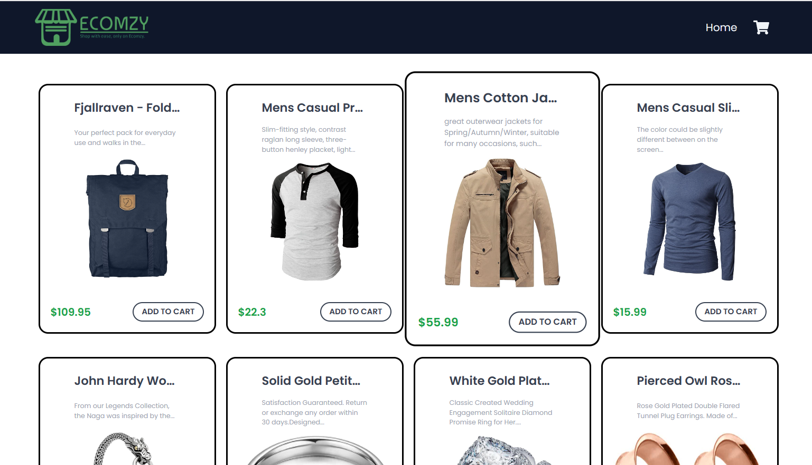
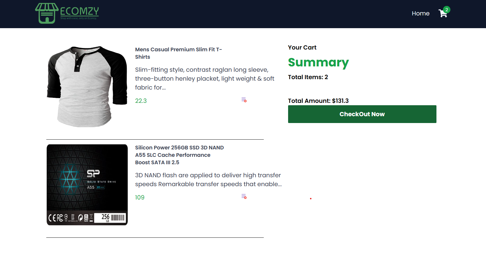
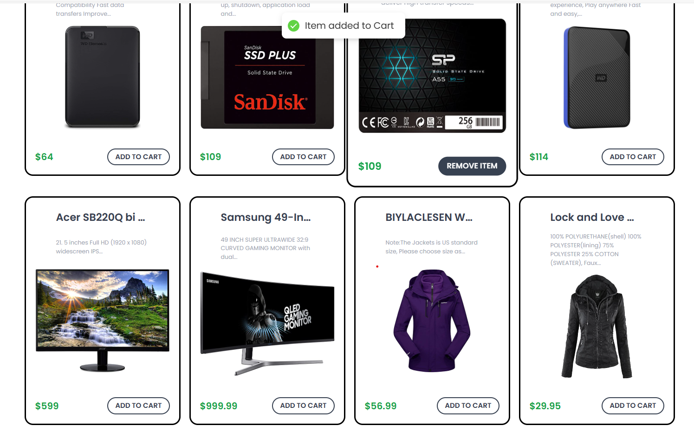
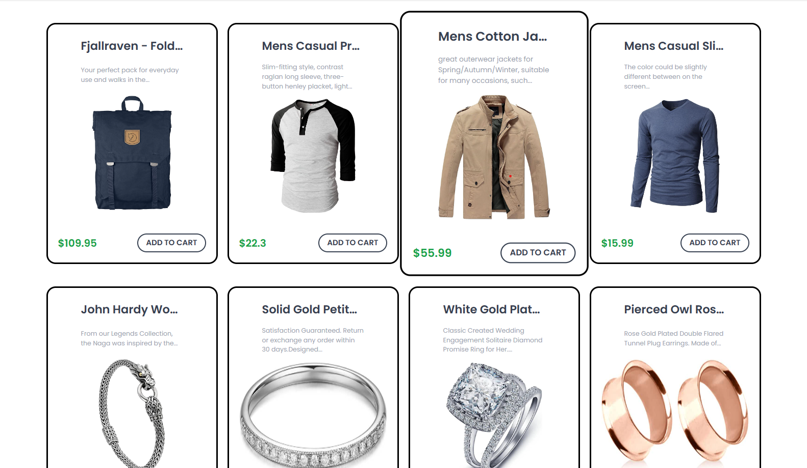

# shoping_cart
# Shop your required items 
:rocket: [Link to website][https://weatherapp-iota-self.vercel.app/]

# _________________________________________________________________________________________________________________________________________
## Introduction

Introducing a dynamic Shopping Cart web application! Seamlessly explore and add multiple items to your cart, with an interactive UI that ensures a delightful user experience. Easily customize your selections, view the sum of your chosen items, and effortlessly remove any products. The application provides a smooth and intuitive buying process, making your shopping journey both enjoyable and efficient. Experience the convenience of a feature-rich Shopping Cart for a seamless and interactive online shopping experience

# _____________________________________________________________________________________________________________________________

## System Architecture

The Shopping Cart web application is crafted with a robust system architecture to guarantee efficiency and responsiveness throughout the user experience. Leveraging React for the front-end ensures an intuitive and visually appealing interface, complemented by CSS for seamless styling. Dynamic content and interactive features are seamlessly implemented using JavaScript, enhancing the overall user interaction. On the back-end, Node.js powers the application, orchestrating data flow and managing requests. The system connects with external APIs to retrieve product information and utilizes a database to store user preferences, cart contents, and transaction history, ensuring a personalized and efficient shopping experience.

# __________________________________________________________________________________________________________________________________

### Front-end

The frontend of Shopping Cart web application is a visually engaging and user-friendly interface designed with React.js, ensuring a seamless and interactive shopping experience. Leveraging HTML for structuring and CSS for styling, the frontend offers an intuitive layout and visually appealing design. The dynamic content and real-time updates are powered by React, allowing users to effortlessly add multiple items to their cart, view a consolidated summary of selected products, and easily remove items if needed. The UI incorporates modern design principles to enhance user navigation and satisfaction, providing a delightful environment for exploring and purchasing products. The frontend of your Shopping Cart prioritizes responsiveness and efficiency, offering a compelling and enjoyable online shopping journey for users.

